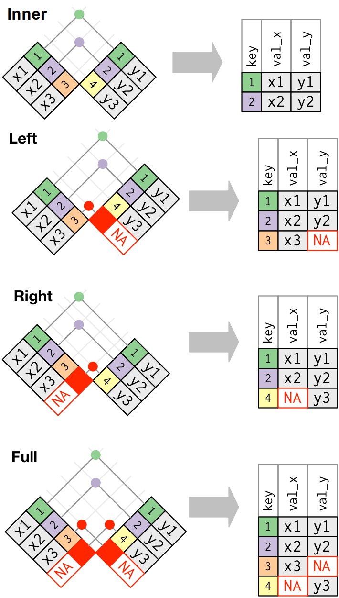

# Rad sa podacima

U ovom poglavlju ćemo se upoznati sa osnovnim metodama rada sa podacima, prvenstveno kroz paket `dplyr`, koji je jedan od najkorišćenijih paketa u R-u. Pre upoznavanja sa tim paketom, osnvrnućemo se na osnovnu strukturu podataka u R-u, dataframe, koja se koristi za rad sa tabelarnim podacima.

```{r echo=FALSE, include=FALSE}
weather <- nycflights13::weather
```

## Dataframe

Dataframe je najčešći način čuvanja podataka u R-u i vrlo je pogodan za rad i analizu. Služi za prikaz tabelarnih podataka, pa liči na matricu, s tim što je dataframe u snovi lista koja sadrži vektore jednakih dužina (kolone), pri čemu ti vektori ne moraju biti istog tipa. Dakle možemo imati jednu kolonu koju čine brojevi, a drugu tekstualni podaci.

Dataframe se pravi na sledeći način:

```{r}
df <- data.frame(kolona1 = c(1, 2, 3), kolona2 = c("prvi", "drugi", "treci"))
df
```

Ovako smo dobili dataframe sa dve kolone, od kojih je jedna numerička a druga tekstualna.

```{r}
str(df)
```

R podrazumevano pretvara tekstualne podatke u faktore, to možemo preduprediti ako dodamo argument `stringsAsFactors = FALSE`.

```{r}
df <- data.frame(kolona1 = c(1, 2, 3), kolona2 = c("prvi", "drugi", "treci"), stringsAsFactors = FALSE)
str(df)
df
```

Dva dataframe-a (koji imaju isi broj kolona) se mogu spojiti da dobijemo više kolona korišćenjem funkcije `cbind`.
```{r}
df1 <- data.frame(kolona1 = c(1, 2, 3), kolona2 = c("prvi", "drugi", "treci"), stringsAsFactors = FALSE)
df2 <- data.frame(kolona3 = c(4,5,6), kolona4 = c("prvi1", "drugi1", "treci1"), stringsAsFactors = FALSE)
df3 <- cbind(df1, df2)
df3
```

Takodje, mogu se nadovezati po vrstama (ako imaju ista imena kolona) funkcijom `rbind`.

```{r}
df1 <- data.frame(kolona1 = c(1, 2, 3), kolona2 = c("prvi", "drugi", "treci"), stringsAsFactors = FALSE)
df2 <- data.frame(kolona1 = c(4,5,6), kolona2 = c("prvi1", "drugi1", "treci1"), stringsAsFactors = FALSE)
df4 <- rbind(df1, df2)
df4
```

Vrednostima kolona možemo pristupati pomoću operatora `$`, kao u listama, a istim možemo i dodati nove kolone.
```{r}
df$kolona1
df$kolona5 <- c(7,8,9)
df
```

Medjutim, možda elegantniji način filtriranja i odabira podskupova dataframe-a je korišćenjem uglatih zagrada. Koristimo notaciju `df[redovi, kolone]`, gde prvim argumentom odredjujemo koje redove želimo da uzmemo, a drugim koje kolone. Prazno mesto za neki od argumenata znači "uzmi sve".

```{r}
df[,] # sve
df[1,] # prva vrsta
df[,1] # prva kolona
```

Redovi mogu biti ili vektori brojeva koji označavaju indekse redova koje da uzmemo, ili vektori TRUE/FALSE vrednosti iste dužine kao broj vrsta u dataframe-u, pri čemu se tada biraju redovi na pozicijama gde je u vektoru vrednost TRUE.

```{r}
df4[c(1,3,4), ] # sve kolone, redovi 1,3,4
df4[df4$kolona1 > 3, ] # sve kolone, one vrste kod kojih je kolona1 veca od 3
```

Kolone mogu biti ili vektori brojeva koji označavaju koje kolone da uzmemo prema indeksu, ili vektori stringova, koji označavaju imena kolona koje da uzmemo.

```{r}
df3[, c(1,3)] # sve vrste, 1 i 3 kolona
df3[, c("kolona1", "kolona3")] # isto
df3[c(1,3), c("kolona1", "kolona3")] # prvi i treci red, prva i treca kolona
```

Korisna stvar je da ako koristimo vektore brojeva za indeksiranje, ukoliko stavimo znak `-` ispred, to znači da izuzimamo te redove/kolone.

```{r}
df[, -1] # sve bez prve kolone
df[-2, ] # sve bez druge vrste
df[-c(1,2), c("kolona2", "kolona5")] # druga i peta kolona, bez prve i druge vrste
```

Konačno, za osnovne informacije o tabeli postoje funkcije `colnames`, `rownames`, `ncol` i `nrow`, za koje možete pretpostaviti šta rade.

## Obrada podataka - `dplyr` paket

Prethodno navedeni način rada sa tabelarnim podacima učitanim kao dataframe može postati prilično nezgrapan kod komplikovanijih zahteva, pa je stoga smišljen mnogo elegantniji pristup pomoću paketa `dplyr`. Uvodni tutorijal za paket možete naći i na https://cran.r-project.org/web/packages/dplyr/vignettes/dplyr.html.

Zansnovan je na korišćenju nekoliko osnovnih radnji koje se primenjuju na podacima, koje su implementirane funkcijama:

- `select` - biranje kolona iz tabele
- `filter` - filtriranje vrsta tabele
- `arrange` - sortiranje vrsta na osnovu nekih kolona
- `mutate` - pravljenje novih kolona korišćenjem postojećih
- `summarise` - računanje neke sumarne statistike (grupisanih) podataka

Postoji i mnogo više funkcija u ovom paketu, koje su često slične navedenim i koje ćemo kad za to bude potrebe pokazati.

Uz ovaj paket se upotrebljava malo čunija sintaksa, zasnovana na korišćenju operatora kompozicije `%>%`. Najlakše ćemo pokazati primerom šta on radi.

Uzmimo pomoću paketa `dplyr` kolonu 1 iz našeg dataframe-a.
```{r}
library(dplyr)
df %>% select(kolona1)
```
Ovo je ekvivalentno pozivu

```{r}
select(df, kolona1)
```

Operator `%>%` radi tako što prosledjuje levi operand kao prvi argument funkcije date sa desne strane operatora, pa ostale argumente prosledjuje kao dodatne. Suštinski, kod `x %>% f(y)` postaje `f(x, y)`. Ako želimo da specifikujemo gde hoćemo da stavimo levu stranu operatora, koristimo `.`. Na primer, gornji kod je ekvivalentan

```{r}
df %>% select(., kolona1)
```
Vremenom će postati ovakva sintaksa prirodna. Vrlo je elegantna jer omogućava jednostavno nadovezivanje. Na sledeći način iz `df` izaberemo prve dve kolone i filtriramo da uzmemo vrste gde je prva kolona veća od 1.

```{r}
df %>%
  select(kolona1, kolona2) %>%
  filter(kolona1 > 1)
```

Ovime smo videli već primere korišćenja dve funkcije u `dplyr` paketu - `select` i `filter`.

## Učitavanje eksternih podataka

Prikažimo mogućnosti paketa `dplyr` kroz istraživanje podataka o životnom veku u državama, poteklih od Svetske zdravstvene organizacije. Podaci koje ćemo posmatrati su dostupni na https://www.kaggle.com/kumarajarshi/life-expectancy-who.

Kada preuzmemo podatke, učitavamo ih funkcijom `read.csv`:

```{r}
who_data <- read.csv("Life Expectancy Data.csv")
who_data %>% sample_n(15) # stampamo 15 slucajno izabranih
```

Paket `dplyr` koristi malo bogatiju strukturu umesto dataframe-a za tabelarne podatke, a to je tibble. Podatke pretvaramo u taj format na sledeći način:

```{r}
who_data <- as_tibble(who_data)
who_data
```
Vidimo blage razlike u prikazu.

Korisno je pogledati podatke funkcijom `glimpse` (iz `dplyr`), gde vidimo tip promenljivih i prvih nekoliko podataka iz odgovarajuće kolone.

```{r}
glimpse(who_data)
```

Sumarne podatke po kolonama vidimo ugradjenom funkcijom `summary`.

```{r}
summary(who_data)
```

## Osnovne funkcije paketa `dplyr`

Proći ćemo nekoliko primera osnovnih funkcija iz paketa. Najviše ćemo koristiti podatke iz paketa `nycflights13`, pa ga učitavamo

```{r}
library(nycflights13)
```

Prelazimo na pregled funkcija.

### `select` - odabir kolona

Sa ovom funkcijom smo se već susreli i nećemo dužiti. Ona služi da iz tabele koja ima mnogo kolona odaberemo samo one koje su nam od interesa, radi lakšeg pregleda.

Odaberimo iz baze `flights` samo kolone godina, mesec, dan, polazipte i destinacija.

```{r}
flights %>%
  select(year, month, day, origin, dest)
```

### `filter` - Filtriranje redova

Ova funkcija služi za odabir odgovarajućih vrsta tabele, tj. opservacija, na osnovu željenih kriterijuma.

Kao primer, možemo da izdvojimo iz baze letova one letove koji idu ka Portlandu, sa kodom aerodroma `"PDX"`.

```{r}
portland_flights <- flights %>%
  filter(dest == "PDX")
#View(portland_flights)
```

Kao argument funkciji `filter` prosledjuje se uslov koji želimo da ispunjavaju redovi koje biramo. To je zapravo vektor `TRUE` i `FALSE` vrednosti, kao kod indeksiranja klasičnog dataframe-a. Ovde smo koristili operator jednakosti `==`, ali možemo koristiti i druge matematičke operatore poput `>`, `<`, `>=`, `<=`, `!=`. Više kriterijuma možemo spajati operatorima konjukcije `&` ('i') i disjunkcije `|` ('ili'). Naravno, pored ovih, mogu se koristiti bilo koje funkcije koje daju kao rezultat logičke vektore.

Na primer, možemo da odaberemo letove koji kreću sa aerodroma JFK, a leteli su duže od sat vremena.

```{r}
flights %>%
  filter(origin == "JFK" & air_time > 60)
```


Odredimo sve letove sa JFK do Berlingtona (BTV) i Sijetla (SEA), koji su od oktobra do kraja godine.

```{r}
btv_sea_flights <- flights %>% 
  filter(origin == "JFK" & (dest == "BTV" | dest == "SEA") & month >= 10)
#View(btv_sea_flights)
```

Umesto korišćenja operatora konjunkcije, možemo samo razdvojiti sve uslove koji moraju biti zadovoljeni sa zapetom.

```{r}
btv_sea_flights <- flights %>% 
  filter(origin == "JFK", (dest == "BTV" | dest == "SEA"), month >= 10)
#View(btv_sea_flights)
```


### `arrange` - sortiranje redova

Često ima smisla sortirati podatke u odnosu na neku kolonu prilikom istraživanja podataka. Paket `dplyr` nam daje jednostavan način za to kroz funkciju `arrange`. Par jednostavnih primera sledi.

Sortirajmo letove po trajanju leta rastuće...

```{r}
flights %>%
  arrange(air_time) %>%
  select(tailnum, air_time)
```

... ili opadajuće

```{r}
flights %>%
  arrange(desc(air_time)) %>%
  select(tailnum, air_time)
```

Vrlo korisna opcija je što se sortiranje može vršiti po više promenljivih. Na primer, da bismo sortirali letove po datumu leta, počevši od najskorijeg, treba da sortiramo prvo opadajuće po mesecu, ali i one iz istog meseca treba sortirati opadajuće po danu. Ovo radimo na sledeći način

```{r}
# radi lakseg pregleda, uzecemo podskup od
# 10 letova
set.seed(1)
subflights <- flights %>% sample_n(10) 
subflights %>%
  arrange(desc(month), desc(day)) %>%
  select(tailnum, month, day)
```

**Napomena!** Obratite pažnju, bitan je redosled argumenata u `arrange`, ako sortiramo prvo po danu pa po mesecu, ne dobijamo željeni rezultat.

```{r}
subflights %>%
  arrange(desc(day), desc(month)) %>%
  select(tailnum, month, day)
```

Sortirajmo letove opadajuće po datumu, ali rastuće po trajanju leta

```{r}
flights %>%
  arrange(desc(month), desc(day), air_time) %>%
  select(tailnum, month, day, air_time)
```

### `mutate` - dodavanje nove kolone

Ovom funkcijom možemo da napravimo nove kolone koristeći postojeće. Na primer, možemo da vršimo konverziju iz Farenhajta u Celzijus.

```{r temperatura}
# ovako smo ranije
# weather$celsius <- (weather$temp - 32) * 5 / 9

# dplyr nacin:
weather <- weather %>%
  mutate(celsius = (temp - 32) * 5 / 9)

#View(weather)
```

Možemo praviti više novih kolona odjednom. Na primer, dodaćemo kolonu "gain" koja predstavlja razliku izmedju kašnjenja polaska i kašnjenja dolaska, tj. neki vid nadoknadjenog vremena kada je let kasnio sa polaskom. Pored toga, dodaćemo kolonu koja predstavlja let u satima, i odrediti i "gain" po satu.

```{r}
flights <- flights %>% 
  mutate(
    gain = dep_delay - arr_delay,
    hours = air_time / 60,
    gain_per_hour = gain / hours
  )
```

I sortiramo po `gain_per_hour`

```{r}
flights %>%
  arrange(gain_per_hour) %>%
  select(dep_delay, arr_delay, gain, hours, air_time, gain_per_hour)
```

Ako uposlimo i paket `lubridate`, koji značajno olakšava rad sa datumima u R-u, možemo dodati i kolonu koja sadrži tačno vreme leta, umesto komponenti koje imamo sada.

```{r}
#install.packages("lubridate")
library(lubridate)

flights <- flights %>% 
  mutate(departure = make_datetime(year, month, day, hour, minute))

flights %>%
  select(year, month, day, hour, minute, departure)
```

Sada prethodno sortiranje opadajuće možemo odratiti po toj novoj koloni.

```{r}
set.seed(1)
flights %>% sample_n(10) %>%
  arrange(desc(departure)) %>%
  select(tailnum, month, day, departure)
```


Specijalan slučaj `mutate` naredbe je `rename` koju koristimo za preimenovanje kolona.

```{r}
weather %>% rename(temp_C = celsius)
```

### `summarise` - sumarne statistike

Ova, jedna od korisnijih funkcija, služi za računanje neke statistike nad podacima. Podaci mogu biti i grupisani, što ćemo videti kasnije. Za početak, vidimo neki prosti primer.

Prosečno vreme trajanja letova dobijamo ovako:

```{r}
flights %>% summarise(mean(air_time))
```
Ima NA vrednosti, pa dodajemo `na.rm = TRUE`, da bi ih ignorisali prilikom računa.

```{r}
flights %>% summarise(mean(air_time, na.rm = TRUE))
```

Da vidimo i ukupan broj letova, koristimo specijalnu funkciju `n()`. Dodajmo i kvantile iz poziva `summary`.

```{r}
no_na_flights <- flights %>%
  filter(!is.na(air_time))

no_na_flights %>%
  summarise(
    count = n(),
    min_time = min(air_time),
    time_q1 = quantile(air_time, 0.25),
    median_time = median(air_time),
    mean_time = mean(air_time),
    time_13 = quantile(air_time, 0.75),
    max_time = max(air_time)
  )
```

Vidimo poklapanje sa `summary`.

```{r}
summary(no_na_flights$air_time)
```

### `group_by` - grupisanje opservacija

Često je potrebno, posebno za sumarizavije, da grupišemo podatke u odnosu na neku promenljivu, da bismo videli svojstva odgovarajućih grupa. Na primer, možda želimo da vidimo prosečnu temperaturu po mesecima iz skupa podataka `weather`, umesto sveukupnog proseka temperature u celoj tabeli. To radimo uz pomoć funkcije `group_by`.

```{r}
library(nycflights13)
library(dplyr)
weather %>%
  group_by(month) %>%
  summarise(mean_temp = mean(temp, na.rm = TRUE),
            stdev_temp = sd(temp, na.rm = TRUE))
  
```

Ovo naravno možemo i prikazati grafiički pomoću bar plota.

```{r}
library(ggplot2)
weather %>%
  group_by(month) %>%
  summarise(mean_temp = mean(temp, na.rm = TRUE),
            stdev_temp = sd(temp, na.rm = TRUE)) %>%
  ggplot(aes(x = month, y = mean_temp)) + geom_col()
```

Analizirajmo malo dijamante. U `ggplot2` paketu postoji skup podataka `diamonds`.

```{r}
diamonds
glimpse(diamonds)
```

Pogledajmo cenu u zavisnosti kvaliteta (promenljiva `cut`)

```{r}
diamonds %>%
  group_by(cut) %>%
  summarise(avg_price = mean(price))
```

Pogledajmo malo kako radi `group_by`. Ideja je da od originalnog dataframe-a napravi grupisani dataframe kod koga se operacije primenjuju na svaku grupu ponaosob, umesto kolektivno na celu tabelu.

```{r}
diamonds_by_cut <- diamonds %>% group_by(cut)
diamonds_by_cut
```

Ovaj dataframe je u suštini isti kao ranije, samo što je naznačeno da se grupiše po promenljivoj `cut`.
Svaka operacija se sada na ovaj dataframe primenjuje na svaku grupu, npr, da vidimo broj elemenata:
```{r}
# grupisano
diamonds_by_cut %>%
  summarise(n())
# negrupisano
diamonds %>% # moze i ungroup(diamonds_by_cut)
  summarise(n())
```

Nisu sumarizacije jedina opcija. Možemo i odabrati podatak kod koga je najveća cena u svakoj grupi.

```{r}
diamonds_by_cut %>%
  filter(price == max(price))
```

Primetimo, ovde biramo celu vrstu, ne gledamo samo koliki je maksimum.

Dakle, možemo i filtrirati po grupama. Uzmimo iz svake grupe 0.0001% najskupljih.
```{r}
diamonds_by_cut %>%
  filter(price > quantile(price, 0.9999)) %>%
  arrange(cut)
```
Vidimo da ovo nije isto kao negrupisani poziv, gde su `"Fair"` i `"Good"` kvaliteti izostavljeni.
```{r}
ungroup(diamonds_by_cut) %>%
  filter(price > quantile(price, 0.9999)) %>%
  arrange(cut)
```

Bolje od kvantila je da koristimo funkciju `top_n`, za top 2 najskuplja po kvalitetu

```{r}
diamonds_by_cut %>%
  top_n(2, price) %>%
  arrange(cut)
```

Poput sortiranja, i grupisanje se može vršiti po više promenljivih. Na primer, da se vratimo na naše avione, možemo da proverimo koliko je letova bilo u svakom mesecu, ali i njih da grupišemo po aerodromima sa kog su poleteli.

```{r}
flights %>%
  group_by(origin, month) %>%
  summarise(count = n())
```

Možemo i izdvojiti 3 najprometnija meseca za svaki aerodrom. 

```{r}
flights %>%
  group_by(origin, month) %>%
  summarise(count = n()) %>%
  top_n(3, count)
```

Kako ovo radi? Prilikom prvog poziva `summarise` "skinuli" smo zadnji sloj grupisanja, pa smo dobili dataframe grupisan samo po `origin`, pa na njemu `top_n` radi po grupama za polazni aerordrom. Stoga je bitan redosled grupisanja za ovakve operacije.

### `join` - spajanje tabela

Kada radimo sa dva povezana skupa podataka, nailazićemo na promenljive koje postoje u oba i po kojima bismo mogli ta dva skupa da spojimo u jednu tabelu. Dobar i dosta dublji tutorijal za join operacije je u okviru knjige R for Data Science, na [ovom linku](https://r4ds.had.co.nz/relational-data.html#mutating-joins).

Na primer, ako pogledamo tabele `airlines` i `flights`

```{r}
airlines
flights
```

vidimo da imaju kolonu `carrier` koja označava skraćenicu avio kompanije. Možemo dodati u tabelu flights puno ime avio kompanije koristeći informaciju u tabeli `airlines`:

```{r}
full_airline <- flights %>%
  inner_join(airlines, by = "carrier")
full_airline %>%
  select(tailnum, carrier, name)
```

Iskoristili smo funkciju `inner_join` ovaj put. Postoji više `*_join` funkcija u `dplyr` paketu, koje odgovaraju onima iz SQL jezika. Takodje, ova operacija je toliko popularna u SQL-u, da ima svoju adresu: http://www.sql-join.com/ (koja se može koristiti za razumevanje).

Glavna razlika medju `*_join` funkcijama je:

* `inner_join` zadržava samo one redove za koje u obe tabele postoji vrednost, tj. koje je mogao da upari sa redovima iz druge tabele.
* `left_join` zadržava sve redove iz prve tabele, a tamo gde nema para stavi NA
* `right_join` zadržava sve redove iz druge tabele
* `full_join` zadržava sve redove iz obe tabele

Na sledećoj slici vidi se grafički prikaz ovih operacija.

{width=50%}

Dakle, kod nas je više smisla imalo koristiti `left_join`, iako je isti rezultat ovaj put.

```{r}
full_airline <- flights %>%
  left_join(airlines, by = "carrier")
```

Pokazaćemo sada na primeru razlike izmedju ovih raznih vrsta join operacije. Koristimo primere preuzete sa uputstva na stranici https://stat545.com/bit001_dplyr-cheatsheet.html.

Prvo kreiramo tabele

```{r}
library(readr)
superheroes <- "
    name, alignment, gender,         publisher
 Magneto,       bad,   male,            Marvel
   Storm,      good, female,            Marvel
Mystique,       bad, female,            Marvel
  Batman,      good,   male,                DC
   Joker,       bad,   male,                DC
Catwoman,       bad, female,                DC
 Hellboy,      good,   male, Dark Horse Comics
"
superheroes <- read_csv(superheroes, skip = 1)

publishers <- "
  publisher, yr_founded
         DC,       1934
     Marvel,       1939
      Image,       1992
"
publishers <- read_csv(publishers, skip = 1)
```

#### Inner join

Prvo da vidimo inner join

```{r}
inner_join(superheroes, publishers, by = "publisher")
```

Vidimo da fali Hellboy, jer Dark Horse Comics nije medju izdavačima u tabeli (a isto nema ni izdavača Image iz tabele izdavača, jer se ne pojavljuje medju herojima).

#### Left join

Kod left join operacije, čuvamo originalnu tabelu u celosti i uparujemo sa drugom gde je moguće

```{r}
left_join(superheroes, publishers, by = "publisher")
```

Sada kod Hellboy-a nemamo godinu osnivanja izdavača. jer ne postoji u tabeli.

#### Right join

Pogledajmo right join.

```{r}
right_join(superheroes, publishers, by = "publisher")
```

Dodao je jedan red pun NA vrednosti, za izdavača Image, koji nije nadjen u prvoj tabeli. Svrha ove operacije je vrlo upitna, pa se retko i koristi.

#### Full join

Full join prikazuje sve redove i upisuje NA tamo gde nešto fali

```{r}
full_join(superheroes, publishers, by = "publisher")
```
 Dakle imamo uniju left i right joina.
 
 